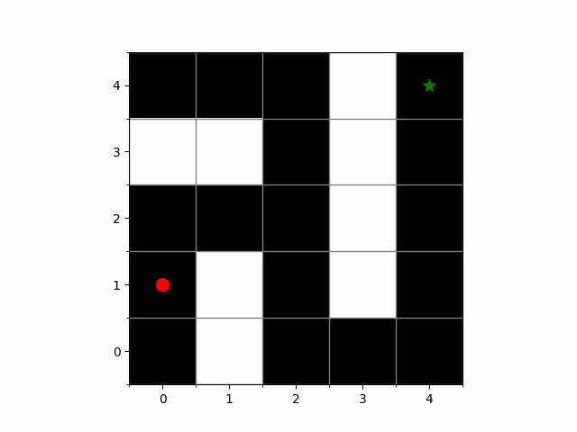

# Reinforcement Learning Maze Solver



A Deep Q-Network (DQN) implementation that learns to navigate through a maze environment using reinforcement learning. This is an extension of a solution for the same problem with [basic q-learning](https://github.com/Davidwarchy/rl)

## Overview

This project implements:
- A customizable maze environment using OpenAI Gym
- A DQN agent that learns optimal paths through the maze
- Visualization tools to display the agent's progress

## Requirements

```
python >= 3.8
torch
numpy
matplotlib
gym
```

## Project Structure

- `maze_env.py`: sets up the maze environment 
- `training_agent.py`: Contains DQN agent implementation and training logic
- `test.py`: Check out the agent try to solve the maze 
- `dqn_maze_solver.pth`: Pre-trained model weights

## Usage

1. Train a new agent:
```python
python training_agent.py
```

2. Test trained agent:
```python
python test.py
```

## Environment

The maze environment (`SimpleMazeEnv`) features:
- Customizable grid-based mazes
- Visual rendering using matplotlib
- Standard gym interface with:
  - Actions: Up, Down, Left, Right
  - Rewards: +200 for reaching goal, -1 for hitting walls, +0.1 for valid moves
  - State: 3x3 grid around agent's current position

## DQN Implementation

The agent uses:
- Experience replay buffer
- Epsilon-greedy exploration
- Two-layer neural network architecture
- MSE loss for Q-value optimization
